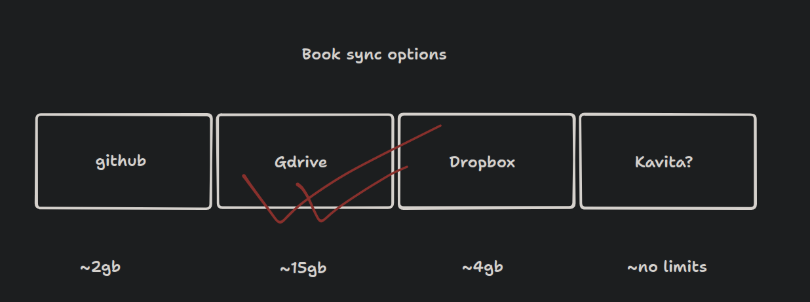
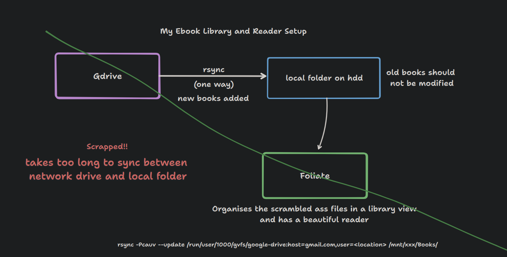
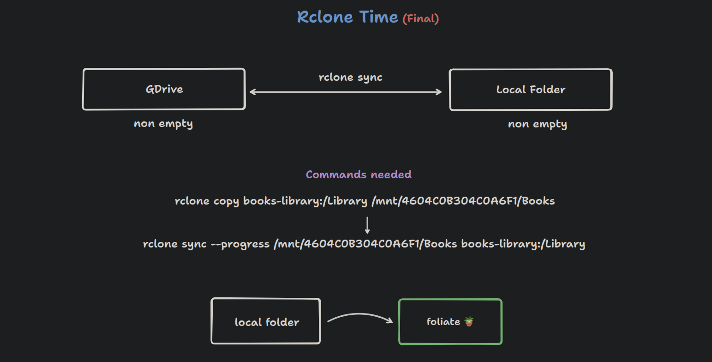

# Ebook Library Setup
> I want to have a ebook library that stays constant across devices and to eliminate the risk of losing any data.

This was my process that I went through to find a solution.

## Storage options
Went with google drive as its convinient and has more than what I need space wise

## Rsync
Ditched because the transfer speed is a roadblock

## Rclone
Works over internet

optional: `rclone copy ~/.local/share/com.github.johnfactotum.Foliate books-library:/Foliate-data`
to sync bookmarks, annotations, etc across devices with foliate